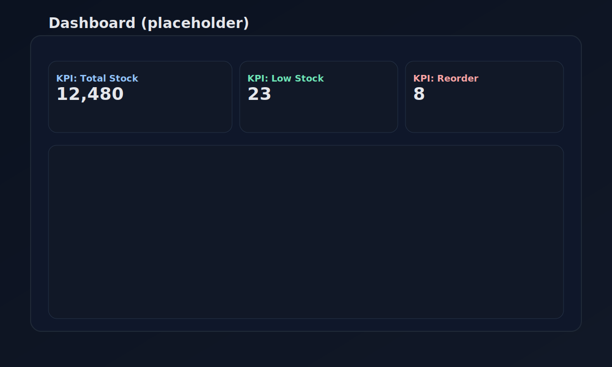
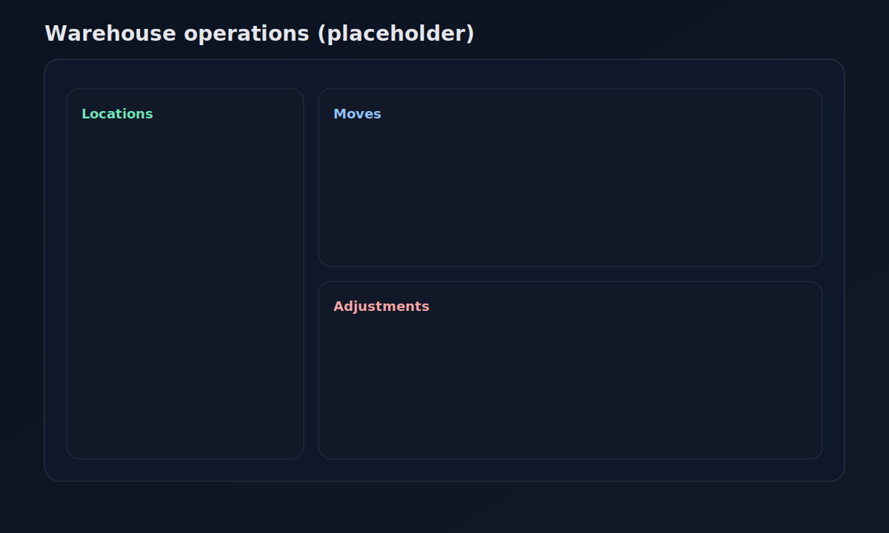
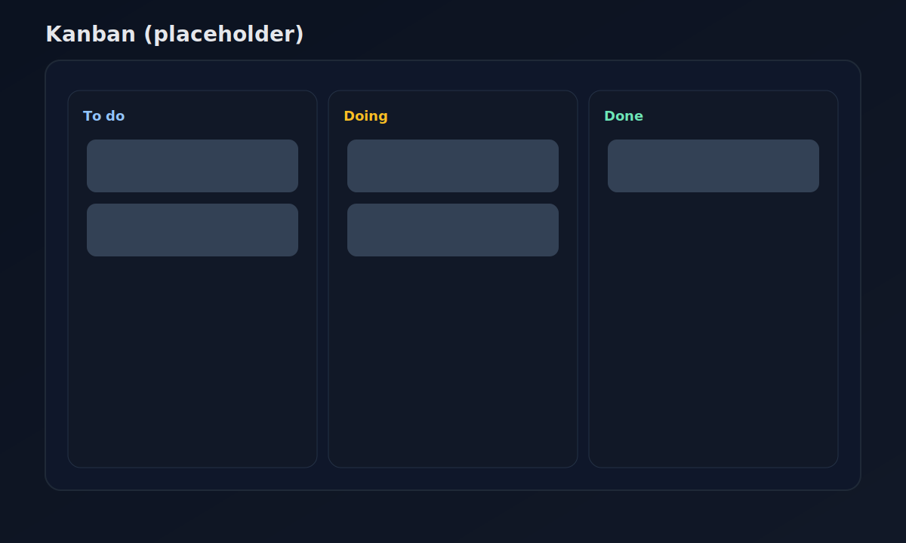
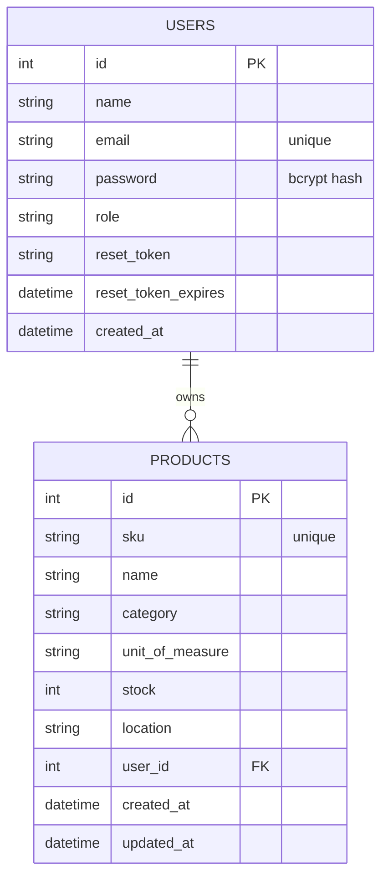

<div align="center">
  

  <h1>SmartInventory <span style="font-weight:400">(StockPilot)</span></h1>

  <p>
    Modern inventory + warehouse operations app with a React dashboard UI and a Node/Express + PostgreSQL API.
  </p>

  <p>
    <a href="#local-setup">
      
    </a>
    <a href="#architecture-interactive">
      
    </a>
    <a href="#api-overview">
      
    </a>
    <a href="#screenshots">
      
    </a>
    <a href="#demo-video">
      
    </a>
  </p>

  <p>
    
    
    
    
    
    
  </p>
</div>

---

## Tech stack

- **Frontend**: Vite + React + TypeScript, Tailwind, shadcn/ui, Zustand, React Router, React Query, React Hook Form + Zod
- **Backend**: Node.js + Express, PostgreSQL (`pg`), JWT auth, bcrypt, Nodemailer (password reset), dotenv, CORS
- **Testing**: Vitest, Playwright

## Table of contents

- [What you get](#what-you-get)
- [Screenshots](#screenshots)
- [Demo video](#demo-video)
- [Architecture (interactive)](#architecture-interactive)
- [Folder structure](#folder-structure)
- [Database model](#database-model)
- [API overview](#api-overview)
- [Why it’s better than many “inventory apps”](#why-its-better-than-many-inventory-apps)
- [Local setup](#local-setup)
- [Scripts](#scripts)
- [Troubleshooting](#troubleshooting)

## What you get

- **Auth**: signup/login with JWT, role selection, forgot/reset password via email
- **Products**: per-user product catalog (CRUD) with stock, category, location, unit of measure
- **Dashboard UI**: KPI cards, tables, warehouse-style navigation and pages

<details>
<summary><strong>Primary user flows</strong></summary>

- User signs up → logs in → receives JWT
- Frontend stores token → calls API with `Authorization: Bearer <token>`
- User manages products → server scopes queries by `user_id`

</details>

## Screenshots

> Replace these placeholders with real app screenshots (keep filenames to preserve the README layout).

<table>
  <tr>
    <td><strong>Dashboard</strong></td>
    <td><strong>Products</strong></td>
  </tr>
  <tr>
    <td></td>
    <td></td>
  </tr>
  <tr>
    <td><strong>Warehouse</strong></td>
    <td><strong>Kanban</strong></td>
  </tr>
  <tr>
    <td></td>
    <td></td>
  </tr>
</table>

## Demo video

> Set `YOUR_VIDEO_ID` to your YouTube video id (the part after `v=`).

<a href="https://youtu.be/iYm1uGx6z7g?si=M6OOPUZDcV-GbX5H" target="_blank" rel="noreferrer">
  
</a>

## Architecture (interactive)

```mermaid
flowchart LR
  U[User Browser] -->|React SPA| FE[Vite + React UI]
  FE -->|HTTPS / JSON<br/>Authorization: Bearer JWT| API[Express API]
  API -->|SQL| DB[(PostgreSQL)]
  API -->|SMTP| MAIL[Email Provider<br/>(Nodemailer)]
```

<details>
<summary><strong>Frontend architecture</strong></summary>

- **Routing**: `react-router-dom` pages in `src/pages/*`
- **State**: Zustand stores in `src/store/*` (auth, inventory, settings, categories)
- **Server state**: React Query for request caching, retries, and background refresh
- **UI system**: shadcn/ui (Radix primitives) + Tailwind for consistent components
- **Forms/validation**: React Hook Form + Zod schemas (client-side guardrails)

</details>

<details>
<summary><strong>Backend architecture</strong></summary>

- **API**: `backend/server.js` (Express) exposes `/api/*`
- **Auth**:
  - JWT signed with `JWT_SECRET` (8h expiry)
  - `verifyToken` middleware protects product routes
- **Password reset**:
  - Random token stored in DB (`reset_token`, `reset_token_expires`)
  - Email sent via Nodemailer; frontend consumes token via reset page
- **Data access**: `pg` Pool in `backend/db.js` from env vars (`DB_HOST`, `DB_PORT`, `DB_NAME`, `DB_USER`, `DB_PASSWORD`)

</details>

## Folder structure

```text
.
├─ src/                       # React app
│  ├─ components/             # UI + app components
│  ├─ pages/                  # Route pages
│  ├─ store/                  # Zustand stores
│  └─ lib/                    # shared utilities
└─ backend/                   # Express + Postgres API
   ├─ server.js               # routes + auth + mail
   ├─ db.js                   # pg connection pool
   └─ schema.sql              # DB schema
```

## Database model



## API overview

### Auth

- `POST /api/signup`
- `POST /api/login`
- `POST /api/forgot-password`
- `POST /api/reset-password`

### Products (JWT required)

- `GET /api/products`
- `POST /api/products`
- `PUT /api/products/:id`
- `DELETE /api/products/:id`

## Why it’s better than many “inventory apps”

- **Multi-tenant by design**: product data is scoped by `user_id` (not a single global table for everyone).
- **Practical auth**: JWT-protected API routes + password reset flow backed by expiring DB tokens.
- **Modern frontend stack**: typed React + component system (Radix/shadcn) + Tailwind consistency + test tooling.
- **Separation of concerns**: SPA frontend and API backend are independent (easier deployment and scaling).

## Local setup

### Prereqs

- Node.js 18+ (recommended)
- PostgreSQL 14+

### 1) Database

Create a database, then run:

```bash
psql -d YOUR_DB_NAME -f backend/schema.sql
```

### 2) Backend env

Create `backend/.env` (don’t commit secrets) with at least:

```env
PORT=5000
JWT_SECRET=replace_me
FRONTEND_URL=http://localhost:5173

DB_HOST=localhost
DB_PORT=5432
DB_NAME=smartinventory
DB_USER=postgres
DB_PASSWORD=replace_me

EMAIL_USER=you@gmail.com
EMAIL_PASS=app_password_or_provider_password
```

### 3) Run backend

```bash
cd backend
npm install
npm run dev
```

### 4) Run frontend

```bash
npm install
npm run dev
```

Frontend runs on the Vite default (`http://localhost:5173`). The backend defaults to `http://localhost:5000`.

## Scripts

### Frontend (root)

| Command | Description |
|---|---|
| `npm run dev` | Start Vite dev server |
| `npm run build` | Production build |
| `npm run lint` | ESLint |
| `npm test` | Vitest (CI run) |
| `npm run test:watch` | Vitest watch mode |

### Backend (`backend/`)

| Command | Description |
|---|---|
| `npm run dev` | Start API with nodemon |
| `npm start` | Start API (no watch) |

## Troubleshooting

<details>
<summary><strong>CORS errors in the browser</strong></summary>

Backend CORS currently allows `http://localhost:5173` and `http://localhost:8080`. If you run the frontend on a different origin, update the allow-list in `backend/server.js`.

</details>

<details>
<summary><strong>Password reset email doesn’t send</strong></summary>

Check `EMAIL_USER` / `EMAIL_PASS` and provider requirements (for Gmail you typically need an “App Password”).

</details>
